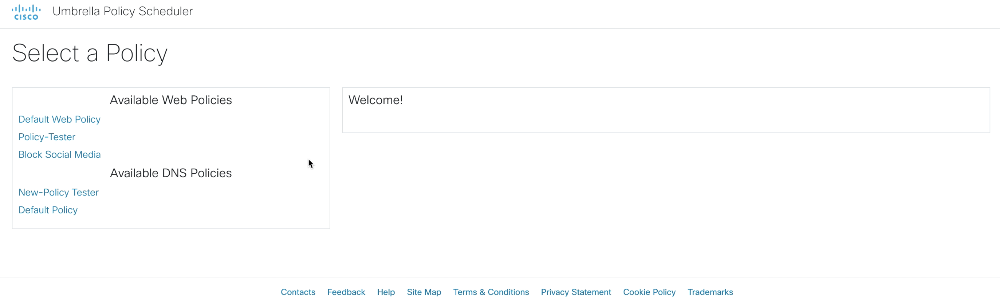

# Umbrella Policy Scheduler
This is the Umbrella Policy Scheduler source code. Using Umbrella API's, we can configure a schedule for Web policies
and when they should be active or not, as well as the identity targets. Time ranges can be configured to set the active times for the policies.

The schedulers are stored in a database which is queried regularly by the server to determine which policies should be activated
or deactivated.

### High Level Design


## Contacts

* Josh Ingeniero (jingenie@cisco.com)
* Monica Acosta (moacosta@cisco.com)

## Solution Components
* Flask
* Docker
* Python
* JavaScript
* Cisco Umbrella API’s

## Installation:

#### Clone the repo
```console
git clone https://wwwin-github.cisco.com/gve/umbrella-policy-scheduler.git
```

### Python

#### Set up a Python venv
First make sure that you have Python 3 installed on your machine. We will then be using venv to create
an isolated environment with only the necessary packages.

##### Install virtualenv via pip
```
pip install virtualenv
```

##### Create a new venv
```
# Change to your project folder
cd umbrella-scheduler

# Create the venv
virtualenv venv

# Activate your venv
source venv/bin/activate
```

#### Install dependencies
```zsh
pip3 install -r requirements.txt
```

### Docker
You have the option to use a docker image hosted on [containers.cisco.com](containers.cisco.com)
or to build the docker image from this repo. You may edit [docker-compose.yml](docker-compose.yml) to use one of the following options:
```yaml
# To build from scratch and generate an image
build: .
# To pull the image from containers.cisco.com
image: containers.cisco.com/jingenie/umbrella-policy-scheduler:latest
```
Pulling the image requires you to log in to the container repository
```commandline
docker login containers.cisco.com
```

You can also edit the timezone used in scheduling in the same file:
```yaml
environment:
      TZ: "Asia/Singapore"
```
A list of valid timezones is available at https://en.wikipedia.org/wiki/List_of_tz_database_time_zones under _TZ Database Name_


## Setup:
You can deploy this prototype in a lab environment, dCloud instance, or on your own deployment.
You would then need to either input your details through the web GUI or edit a config file below.

#### Umbrella details:
You need to have your _Network Devices API Key and Secret, Management API Key and Secret, and Organization ID_.

To generate an API KEY, refer to the documentation [here](https://docs.umbrella.com/umbrella-api/docs/authentication-and-errors).

You must select an organization to manage and use its ORGANIZATION ID. You may do so
[here](https://docs.umbrella.com/deployment-umbrella/docs/find-your-organization-id).

Fill in the details of your Umbrella deployment in the [DETAILS.py](umbrella-scheduler/DETAILS.py) file
```python
MGT_KEY = ''
MGT_SECRET = ''
NET_KEY = ''
NET_SECRET = ''
ORG_ID = ''
```

## Usage:

### Python
Launch the Scheduler Server. Make sure that you have your venv activated.
```commandline
flask run --host=0.0.0.0 --port=5000
```

### Docker
Launch the Scheduler Server through the docker-compose file.
```commandline
docker-compose up
```

### Running
Launch your web browser and navigate to [localhost:5000](localhost:5000) or with your configured port.


### Login Screen


### Policy Selection


### Policy Scheduling


### Deactivated Policy Sample


### Activated Policy Sample


## License
Provided under Cisco Sample Code License, for details see [LICENSE](./LICENSE.txt)

## Code of Conduct
Our code of conduct is available [here](./CODE_OF_CONDUCT.md)

## Contributing
See our contributing guidelines [here](./CONTRIBUTING.md)